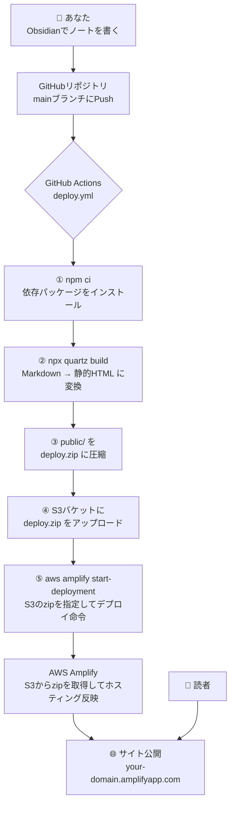
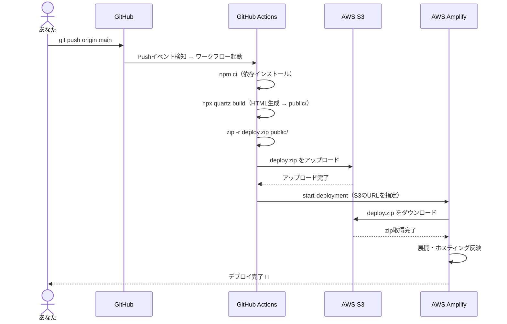
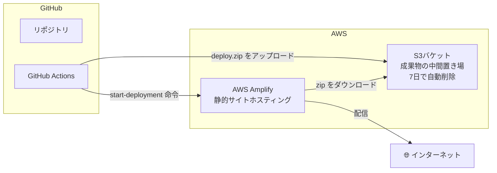
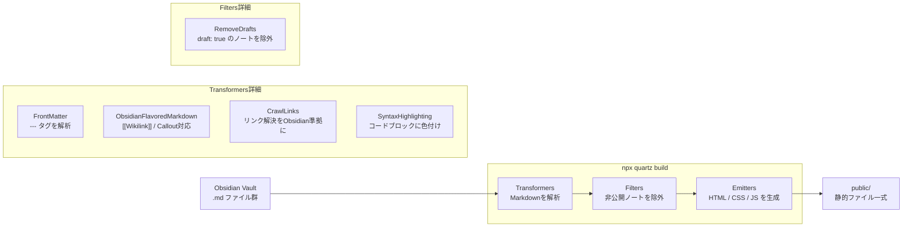

# Obsidian Publish 風 静的サイト

ObsidianのVaultをQuartz v4でビルドし、AWS Amplifyで公開するシステムです。
`main`ブランチにPushするだけで自動でサイトが更新されます。

---

## システム全体像



---

## デプロイの詳細フロー



---

## ページレイアウト（Obsidian Publish風 3カラム）

```
┌─────────────────────────────────────────────────────────────┐
│                         ページ全体                           │
├──────────────┬──────────────────────────┬───────────────────┤
│  左サイドバー │      メインコンテンツ      │  右サイドバー      │
│              │                          │                   │
│ サイト名      │ # 記事タイトル            │ グラフビュー        │
│ 検索          │ 更新日 / 読了時間 / タグ   │ (ノード間の繋がり)  │
│ ダークモード  │                          │                   │
│              │ 本文...                  │ 目次 (PC のみ)     │
│ Explorerツリー│                          │                   │
│ (PC のみ)    │                          │ バックリンク        │
│              │                          │                   │
└──────────────┴──────────────────────────┴───────────────────┘
```

| エリア | コンポーネント |
|---|---|
| 左サイドバー | PageTitle, Search, Darkmode, Explorer（PC限定） |
| メイン上部 | ArticleTitle, ContentMeta, TagList |
| 右サイドバー | Graph, TableOfContents（PC限定）, Backlinks |

---

## AWSインフラ構成



### Terraformで管理しているリソース

| リソース | 内容 |
|---|---|
| `aws_amplify_app` | Amplifyアプリ本体（ビルド機能はOFF） |
| `aws_amplify_branch` | mainブランチ（auto_build無効） |
| `aws_s3_bucket` | デプロイ成果物の中間置き場 |
| `aws_s3_bucket_public_access_block` | バケットへのパブリックアクセスを完全ブロック |
| `aws_s3_bucket_lifecycle_configuration` | 7日経過したzipを自動削除 |

---

## Quartzのコンテンツ処理パイプライン



---

## ディレクトリ構成

```
Obsidian_Publish/
├── quartz.config.ts          # テーマ・プラグイン設定
├── quartz.layout.ts          # 3カラムレイアウト設定
├── content/                  # Obsidian Vaultのmdファイルをここに配置
│
├── .github/
│   └── workflows/
│       └── deploy.yml        # CI/CD（Push → ビルド → Amplifyデプロイ）
│
├── modules/
│   ├── Amplify/              # Amplify Terraformモジュール
│   │   ├── amplify.tf
│   │   ├── variables.tf
│   │   └── outputs.tf
│   └── S3/                   # S3 Terraformモジュール
│       ├── s3.tf
│       ├── variables.tf
│       └── outputs.tf
│
├── environments/
│   └── dev/                  # dev環境の設定
│       ├── main.tf
│       ├── provider.tf
│       ├── variables.tf
│       ├── outputs.tf
│       └── terraform.tfvars  # ← 自分の環境に合わせて編集
│
└── docs/
    └── DD.md                 # 設計書
```

---

## セットアップ手順

### 1. AWSインフラを作成（Terraform）

```bash
cd environments/dev
terraform init
terraform apply
# → amplify_app_id と s3_bucket_name が出力される
```

### 2. GitHub Secretsを登録

リポジトリの **Settings → Secrets and variables → Actions** に以下を追加：

| Secret名 | 説明 |
|---|---|
| `AWS_ACCESS_KEY_ID` | IAMユーザーのアクセスキー |
| `AWS_SECRET_ACCESS_KEY` | IAMユーザーのシークレットキー |
| `AWS_REGION` | `ap-northeast-1` |
| `S3_BUCKET` | `terraform apply`の出力値 |
| `AMPLIFY_APP_ID` | `terraform apply`の出力値 |

### 3. コンテンツを配置してPush

```bash
# ObsidianのVaultをcontentフォルダに配置
cp -r /path/to/your/vault/* content/

git add .
git commit -m "ノートを追加"
git push origin main
# → GitHub Actionsが自動でビルド＆デプロイ
```

---

## ノートの公開・非公開制御

frontmatterで制御できます：

```yaml
---
# 公開したくないノートはこれを追加
draft: true
---
```

`draft: true` がついたノートはビルド時に自動的に除外されます。
