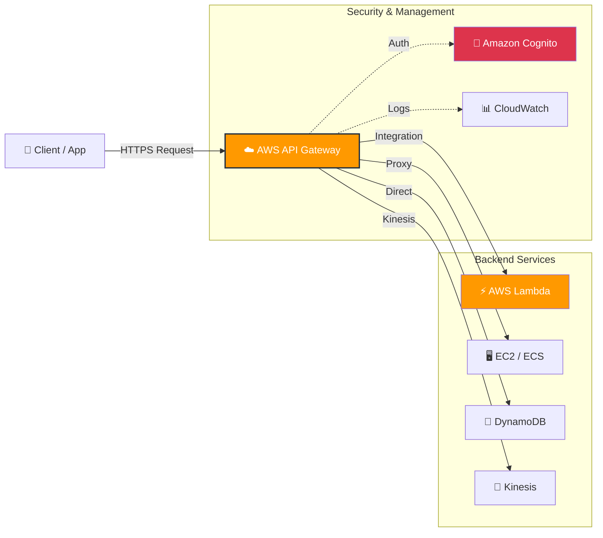

# AWS API Gateway

**Amazon API Gateway** は、あらゆる規模の API の作成、公開、保守、モニタリング、およびセキュア化を簡単に行える AWS のフルマネージドサービスです。サーバーレスアーキテクチャの玄関口（フロントドア）として広く利用されています。

## 🏗️ アーキテクチャ図 (Mermaid)

---

## 🚀 主な API タイプ

AWS API Gateway では、ユースケースに合わせて 3 種類の API を選択できます。

| API タイプ        | 特徴                                                                 | ユースケース                                          | コスト            |
| ----------------- | -------------------------------------------------------------------- | ----------------------------------------------------- | ----------------- |
| **HTTP API**      | 低遅延、低コスト。機能は最小限（CORS, JWT 認証など）。               | シンプルなサーバーレス Web アプリ、マイクロサービス。 | 安い              |
| **REST API**      | 高機能。API キー管理、WAF 連携、詳細なスロットリング設定などが可能。 | エンタープライズ向け、複雑な制御が必要な公開 API。    | HTTP API より高め |
| **WebSocket API** | クライアントとサーバー間で永続的な接続を維持する双方向通信。         | チャットアプリ、リアルタイムダッシュボード。          | メッセージ数課金  |

---

## ⚡ 主な機能

### 1. トラフィック管理

- **スロットリング**: 秒間あたりのリクエスト数（RPS）を制限し、バックエンドを保護します。
- **クォータ**: 日/週/月ごとのリクエスト上限を設定できます。

### 2. セキュリティと認証

- **IAM 認証**: AWS の標準的な権限管理を利用。
- **Amazon Cognito**: ユーザープールを使ったサインイン/サインアップ機能との連携。
- **Lambda オーソライザー**: カスタムロジック（JWT 検証や DB 照合など）による柔軟な認証。

### 3. パフォーマンス最適化

- **API キャッシュ**: レスポンスを一定時間キャッシュし、バックエンドへのアクセスを減らしてレイテンシを短縮します（REST API のみ）。

### 4. カナリアリリース (Canary Release)

- 新しいバージョンの API にトラフィックの数%だけを流し、問題がないか確認してから全体にデプロイする段階的なリリースが可能です。

---

## 🔗 バックエンド統合パターン

API Gateway は単なるプロキシだけでなく、様々な AWS サービスと直接連携できます。

- **Lambda プロキシ統合**: リクエスト全体を Lambda 関数に渡し、レスポンス生成を Lambda に任せる（最も一般的）。
- **AWS サービス統合**: Lambda を挟まずに、直接 DynamoDB にデータを Put したり、Kinesis にレコードを送信したりできます（レイテンシとコストの削減）。
- **HTTP プロキシ**: 既存のオンプレミスサーバーや、AWS 外の Web API へリクエストを中継します。
