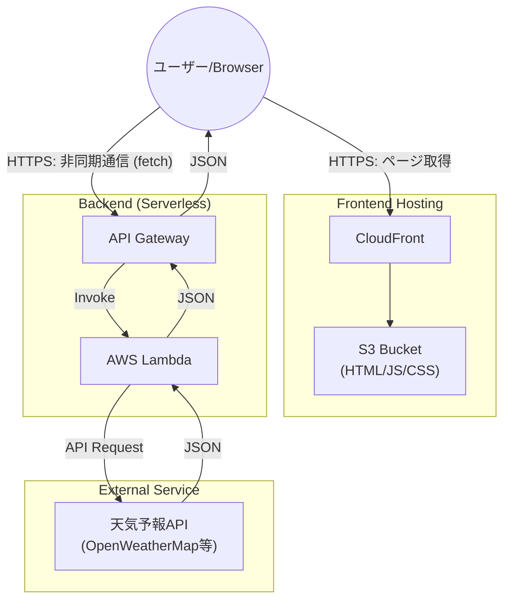

# サーバーレス天気予報アプリケーション設計書

## 1. プロジェクト概要

S3 と CloudFront ですでに構築されている静的サイトに対し、API Gateway と Lambda を組み合わせて「サーバーレス Web アプリケーション」へと拡張する。サーバー（EC2 等）を構築することなく、外部 API を利用した動的な天気予報表示機能を実装する。

## 2. システムアーキテクチャ

### 2.1 構成図 (Mermaid)

### 2.2 データフロー

1. **ユーザー (Browser)**: CloudFront 経由で S3 から HTML/JS を読み込む（既存構成）。
2. **JavaScript (Frontend)**: ページ読み込み時やイベントトリガー時に、非同期処理（`fetch`）で API Gateway の URL へリクエストを送信。
3. **API Gateway**: リクエストを受信し、統合された Lambda 関数を起動。
4. **Lambda (Backend)**:

- 外部天気予報 API へアクセスしデータを取得。
- 必要なデータのみを抽出・整形。
- レスポンスを JSON 形式で返却。

5. **Browser**: 受け取った JSON データを元に DOM を操作し、画面に天気情報を描画。

---

## 3. 実装ステップ

### Step 1: 天気予報 API の選定

Lambda から呼び出す外部データプロバイダを選定する。

- **候補 A: OpenWeatherMap**
- 特徴: 無料枠があり、ドキュメントが豊富。学習用に最適。

- **候補 B: 気象庁 API (非公式)**
- 特徴: 日本語の JSON エンドポイントが存在し、国内情報の扱いが容易。

### Step 2: Lambda 関数の作成

天気情報を取得・整形するバックエンドロジックを実装する。

- **ランタイム**: Node.js または Python 推奨。
- **環境変数**: 外部 API の「API キー」はコードに直書きせず、Lambda の環境変数に設定してセキュリティを確保する。
- **処理内容**: 外部 API へのリクエスト、フィルタリング、JSON レスポンスの生成。

### Step 3: API Gateway の作成

Lambda をインターネット公開するためのエンドポイントを作成する。

- **種類**: HTTP API (コストとシンプルさを優先) または REST API。
- **統合**: 作成した Lambda 関数をターゲットとして紐付ける。

### Step 4: CORS (Cross-Origin Resource Sharing) の設定

異なるドメイン間の通信許可設定を行う（**重要**）。

- **課題**: Frontend ドメイン（例: `example.com`）と API ドメイン（例: `*.amazonaws.com`）が異なるため、ブラウザが通信をブロックする。
- **対策**: API Gateway 側で CORS 設定を有効化し、Frontend のオリジン（`Access-Control-Allow-Origin`）を許可する。

### Step 5: フロントエンド (HTML/JS) の修正

- S3 上の JavaScript ファイルを修正。
- API Gateway のエンドポイント URL に対して `fetch()` を実行するロジックを追加。
- 取得データに応じた UI 更新処理を実装。

---

## 4. 本構成の採用メリット

| 項目             | 詳細                                                                                                 |
| ---------------- | ---------------------------------------------------------------------------------------------------- |
| **セキュリティ** | 外部 API キーを Lambda（サーバー側）に隠蔽可能。クライアントへの漏洩を防ぐ。                         |
| **データ整形**   | クライアントに渡す前にデータの加工・計算が可能。通信量の削減やフロントエンドロジックの簡素化に寄与。 |
| **拡張性**       | 将来的に DB（DynamoDB 等）へのデータ保存が必要になった際、Lambda の修正のみで対応可能。              |
| **運用コスト**   | サーバーレス構成のため、リクエストがない待機時間の課金が発生しない（または極小）。                   |
