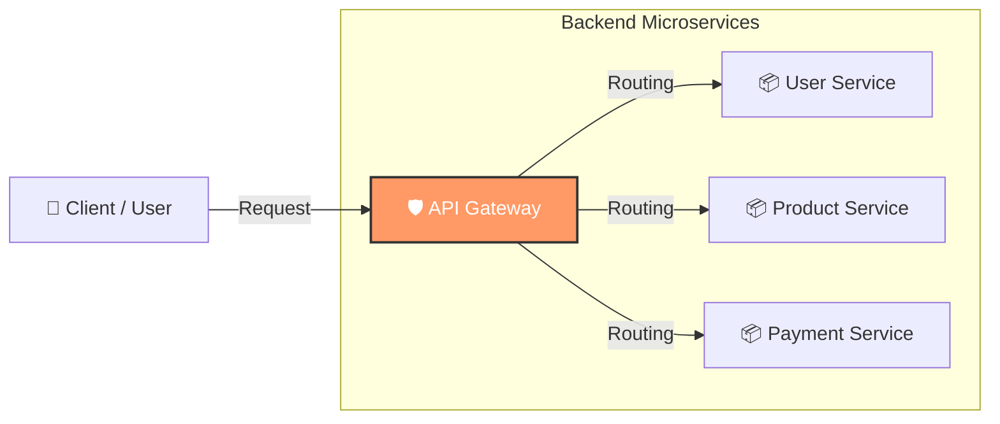

# API Gateway (API ゲートウェイ)

**API Gateway** は、クライアント（Web ブラウザ、スマホアプリなど）とバックエンドのマイクロサービス群の間に位置する「入り口」となるサーバーです。システム全体の受付窓口として機能します。

## 🏗️ 概念図 (Mermaid)

VSCode の Markdown プレビューでは、以下の Mermaid 記法でアーキテクチャ図を表示できます。

---

## 🔑 主な役割と機能

API Gateway は単なる「中継地点」ではなく、以下のような共通処理（Cross-cutting concerns）を一手に引き受けます。

| 機能                           | 説明                                                                                                                       |
| ------------------------------ | -------------------------------------------------------------------------------------------------------------------------- |
| **リクエストルーティング**     | クライアントからのリクエストを適切なバックエンドサービスへ振り分けます（リバースプロキシの役割）。                         |
| **認証・認可 (AuthN/AuthZ)**   | ユーザーの本人確認やアクセス権限のチェックを一元管理します（JWT 検証など）。各サービスで個別に実装する必要がなくなります。 |
| **レート制限 (Rate Limiting)** | クライアントごとのリクエスト数を制限し、サーバーの過負荷や DDoS 攻撃を防ぎます。                                           |
| **プロトコル変換**             | 例：外部向けには `REST/HTTP` を公開し、内部では `gRPC` や `AMQP` で通信するといった変換を行います。                        |
| **キャッシュ**                 | レスポンスを一時的に保存し、バックエンドへの負荷を減らしつつ応答速度を向上させます。                                       |
| **ログ・監視**                 | すべてのトラフィックがここを通るため、アクセスログの収集や分析が容易になります。                                           |

---

## ⚖️ メリットとデメリット

### メリット

- **クライアントの簡素化**: クライアントは多数のサービスの接続先を知る必要がなく、Gateway の URL だけを知っていれば良い。
- **セキュリティ向上**: 外部公開するエンドポイントを最小限に絞り、防御壁として機能する。
- **結合度の低下**: 内部のマイクロサービス構成が変わっても、Gateway 側で吸収すればクライアントへの影響を抑えられる。

### デメリット

- **単一障害点 (SPOF)**: Gateway がダウンすると、システム全体が利用不能になるリスクがある（冗長化が必須）。
- **レイテンシの増加**: ネットワークのホップ数が増えるため、直接通信するよりも応答速度がわずかに遅くなる。
- **運用の複雑化**: 管理すべきコンポーネントが増える。

---

## 🛠️ 代表的なツール・サービス

### クラウドマネージド (PaaS/SaaS)

- **AWS API Gateway**: AWS Lambda 等との連携が強力。
- **Azure API Management**: エンタープライズ向けの機能が充実。
- **Google Cloud API Gateway**: GCP サービスへのセキュアなアクセスを提供。

### オープンソース / ソフトウェア

- **Kong**: NGINX ベースで拡張性が高い。デファクトスタンダードの一つ。
- **Traefik**: コンテナ/マイクロサービス向けに設計されたモダンなプロキシ。
- **NGINX**: 高速な Web サーバーとしてだけでなく、API Gateway としても構成可能。
- **Spring Cloud Gateway**: Java (Spring Boot) 環境での標準的な選択肢。
