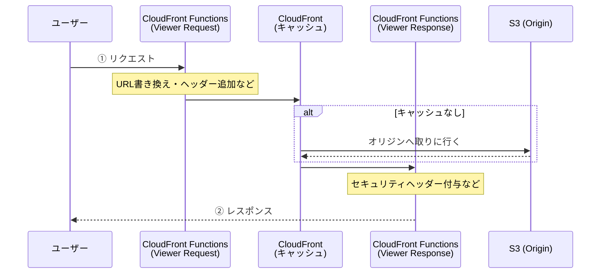

2CloudFront Functions は、CloudFront のエッジロケーションで**超軽量な JavaScript**を実行できる機能です。

ユーザーに最も近い場所でプログラムを動かせるため、リクエストやレスポンスを「一瞬（ミリ秒未満）」で書き換えることができます。

---

### 1. どこで動くのか？（処理のタイミング）

CloudFront Functions は、ユーザー（ビューワー）と CloudFront の間のやり取りに割り込んで動作します。



---

### 2. よくあるユースケース

「わざわざプログラムを書くほどのこと？」と思うかもしれませんが、静的サイト運用では非常に強力な武器になります。

- **URL のリダイレクト/書き換え:** \* `example.com/old-page` へのアクセスを `example.com/new-page` へ転送する。
- `/about` へのアクセスを内部的に `/about.html` として S3 にリクエストする（URL を綺麗に保つ）。

- **ヘッダーの操作:**
- `Strict-Transport-Security` や `X-Frame-Options` などの**セキュリティヘッダー**を全てのレスポンスに自動で追加する。

- **認証の簡易実装:**
- 特定のヘッダーがないリクエストを拒否する、簡易的なトークンチェックを行う。

- **キャッシュ効率の改善:**
- Query String を整理して、キャッシュのヒット率を上げる。

---

### 3. Lambda@Edge との違い

AWS には「エッジでコードを動かす」サービスがもう一つ、**Lambda@Edge** があります。CloudFront Functions は、より「軽量・高速・安価」に特化したものです。

| 特徴         | CloudFront Functions                    | Lambda@Edge                    |
| ------------ | --------------------------------------- | ------------------------------ |
| **言語**     | JavaScript (ECMAScript 5.1 準拠)        | Node.js, Python                |
| **実行時間** | **1 ミリ秒未満** (爆速)                 | 最長 5〜30 秒                  |
| **外部通信** | **不可**（HTTP リクエスト等は送れない） | **可能**（DB や API を叩ける） |
| **コスト**   | **非常に安い** (Lambda@Edge の約 1/6)   | やや高い                       |
| **主な用途** | URL 書き換え、ヘッダー操作              | 本格的な認証、動的な画像生成   |

> **💡 選定のコツ**
> 「ネットワーク通信が必要か？」で判断します。外部 API を叩きたいなら Lambda@Edge、届いたリクエストの内容をその場で少し加工するだけなら CloudFront Functions を選びます。

---

### 4. 実際のコード例（URL 書き換え）

例えば、S3 で静的サイトをホストしている際、`/test` というアクセスを `/test/index.html` に補完したい場合は以下のような短いコードを書くだけで実現できます。

```javascript
function handler(event) {
  var request = event.request;
  var uri = request.uri;

  // もしURLが / で終わっているなら、index.html を付与する
  if (uri.endsWith("/")) {
    request.uri += "index.html";
  }
  // 拡張子がないURLなら、末尾に /index.html を付与する
  else if (!uri.includes(".")) {
    request.uri += "/index.html";
  }

  return request;
}
```

CloudFront Functions（以下 CFF）は、一言で言うと**「CloudFront の入り口と出口で、一瞬で終わるちょっとした JavaScript の処理を加える機能」**です。

「プログラムを動かす」という意味では Lambda と似ていますが、CFF は**1 ミリ秒未満**で実行されるという驚異的な速さと安さが最大の特徴です。具体的にできることを 4 つのカテゴリーで詳しく解説します。

---

### 1. URL の書き換えとリダイレクト

静的サイトを運用する上で、最もよく使われる機能です。

- **ディレクトリインデックスの補完:**
- S3 をオリジンにすると、`example.com/about/` にアクセスしても `about/index.html` を自動で探してくれません。これを CFF で「末尾に `index.html` を付けてから S3 に送る」という処理ができます。

- **古いページから新ページへの転送（301/302 リダイレクト）:**
- サイト構成が変わった際、ユーザーを自動で新しい URL へ飛ばします。

- **デバイスごとの振り分け:**
- ユーザーエージェントを見て、スマホなら `/sp/`、PC なら `/pc/` のコンテンツへ内部的に書き換えます。

### 2. HTTP ヘッダーの操作（セキュリティ強化）

S3 から返ってきたレスポンスに、S3 側では設定できない情報を付け加えます。

- **セキュリティヘッダーの付与:**
- `Strict-Transport-Security` (HSTS) や `X-Frame-Options` など、ブラウザのセキュリティを高めるヘッダーを強制的に追加できます。

- **CORS ヘッダーの調整:**
- 特定のドメインからのアクセスだけを許可するヘッダーを動的に追加します。

### 3. キャッシュ効率の最適化（キャッシュキーの正規化）

CloudFront は「URL が 1 文字でも違うと別のページ」としてキャッシュしてしまいます。これを整理して効率を上げます。

- **クエリパラメータの整理:**
- `?id=1&name=test` と `?name=test&id=1` は同じページなのに、CloudFront は別々にキャッシュしてしまいます。これを「アルファベット順に並べ替える」ことでキャッシュヒット率を高めます。

- **不要なパラメータの削除:**
- 広告用のトラッキングパラメータ（`utm_source`など）を削除して、キャッシュを共通化します。

### 4. 簡易的な認証・アクセス制御

外部サービスに問い合わせる必要がない、シンプルなチェックが可能です。

- **カスタムヘッダーチェック:**
- 「特定の合言葉ヘッダーが含まれていないリクエストは拒否する」といった処理ができます。

- **CloudFront KeyValueStore (KVS) との連携:**
- **2023 年末に登場した強力な機能**です。外部に通信せず、CFF 内で「キーと値（例：ID とパスワードのハッシュ値など）」を読み込めるようになり、より柔軟なアクセス制御が可能になりました。

---

### [制限事項] CFF が「できない」こと

ここが非常に重要です。以下の場合は **Lambda@Edge** を使う必要があります。

- **外部 API との通信:** DB を見に行ったり、外部 API を叩くことはできません。
- **実行時間がかかる処理:** 1 ミリ秒を超えるとエラーになります。
- **大きなプログラム:** コードサイズは 10KB までです。
- **リクエストボディの操作:** POST データの中身を見ることはできません（ヘッダーと URL のみ）。

---

### 活用イメージ（URL 書き換えの例）

```javascript
// CloudFront Functions (Runtime 2.0) の例
async function handler(event) {
  const request = event.request;
  const uri = request.uri;

  // もしURLが「/」で終わっていたら、「index.html」を足す
  if (uri.endsWith("/")) {
    request.uri += "index.html";
  }
  // もしURLにドット（拡張子）が含まれていなければ、ディレクトリとみなして「/index.html」を足す
  else if (!uri.includes(".")) {
    request.uri += "/index.html";
  }

  return request;
}
```

### 次のステップへのアドバイス

もし「自分のサイトで特定のページを非公開にしたい」や「URL の見た目を綺麗にしたい（.html を消したい）」といった具体的な要望があれば、**実際に CFF のコードを書いてコンソール上でテスト**してみるのが一番の近道です。
