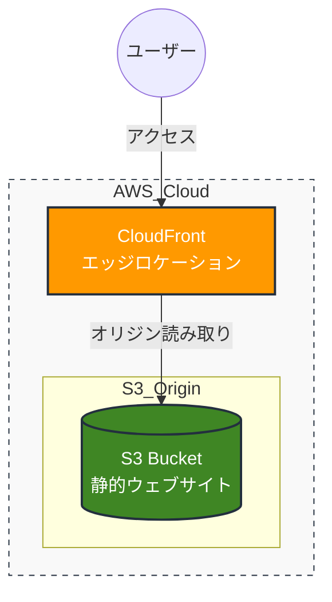

```mermaid
graph TD
    User((ユーザー))

    subgraph AWS_Cloud
        CF[CloudFront <br/> エッジロケーション]

        subgraph S3_Origin
            S3[(S3 Bucket <br/> 静的ウェブサイト)]
        end
    end

    User -->|アクセス| CF
    CF -->|オリジン読み取り| S3

    style CF fill:#FF9900,stroke:#232F3E,stroke-width:2px,color:white
    style S3 fill:#3F8624,stroke:#232F3E,stroke-width:2px,color:white
    style AWS_Cloud fill:#f9f9f9,stroke:#232F3E,stroke-dasharray: 5 5
```
