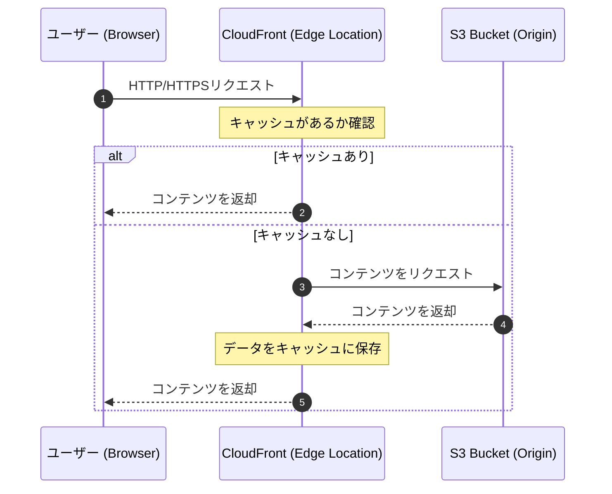

```mermaid
sequenceDiagram
    autonumber
    participant User as ユーザー (Browser)
    participant CF as CloudFront (Edge Location)
    participant S3 as S3 Bucket (Origin)

    User->>CF: HTTP/HTTPSリクエスト
    Note over CF: キャッシュがあるか確認

    alt キャッシュあり
        CF-->>User: コンテンツを返却
    else キャッシュなし
        CF->>S3: コンテンツをリクエスト
        S3-->>CF: コンテンツを返却
        Note over CF: データをキャッシュに保存
        CF-->>User: コンテンツを返却
    end
```
